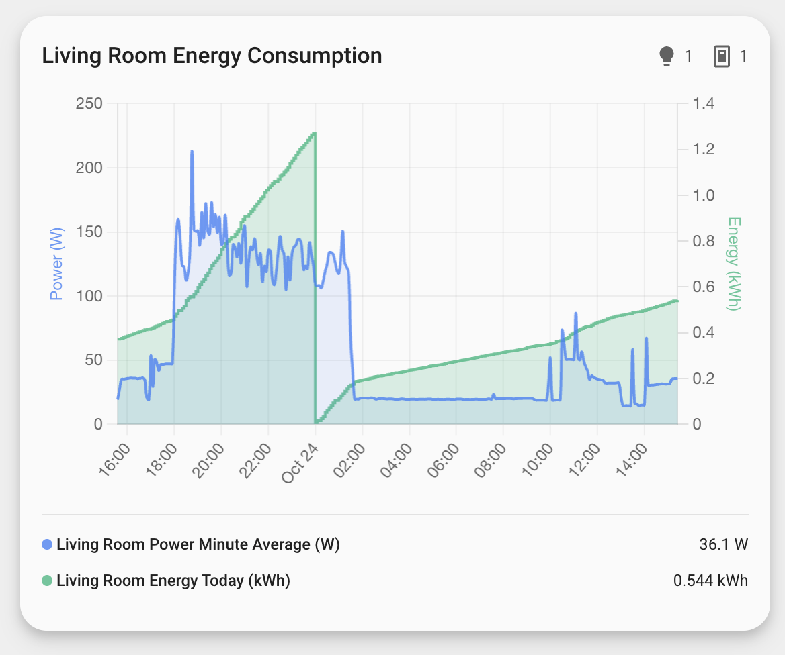
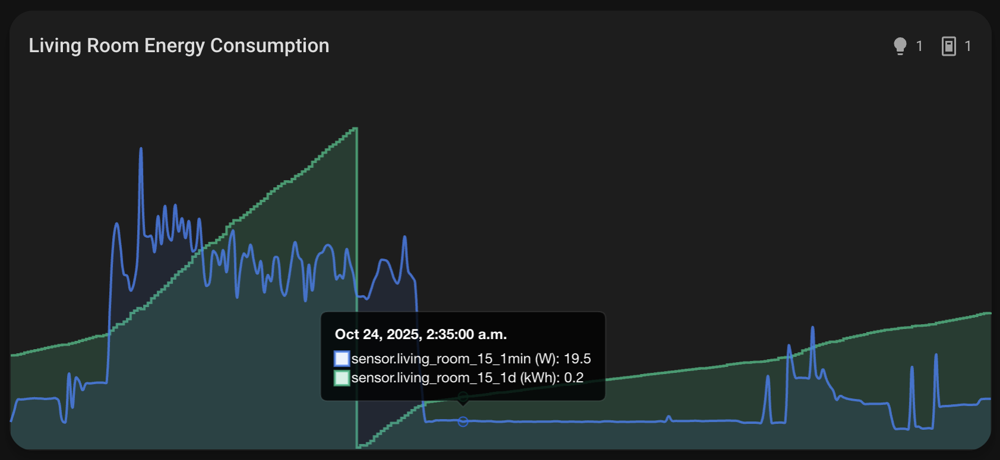
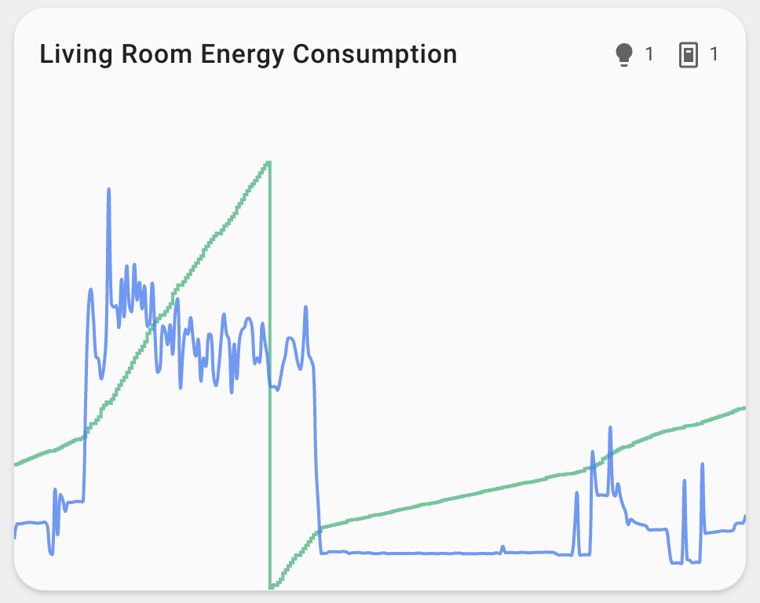
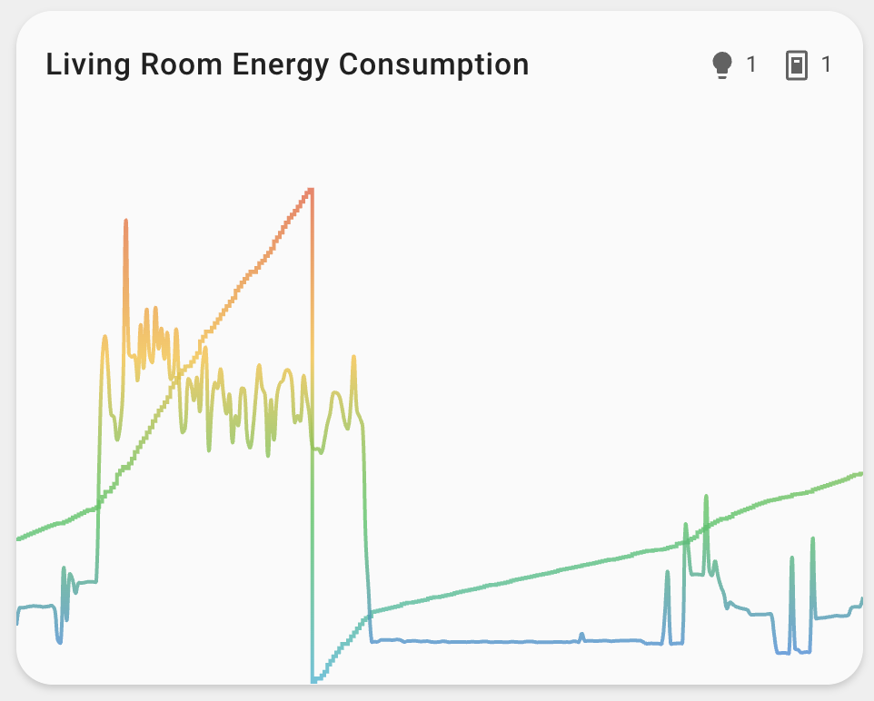
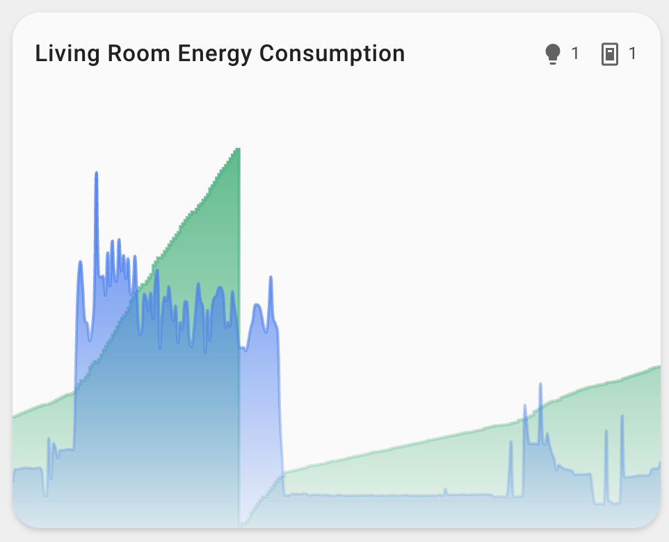
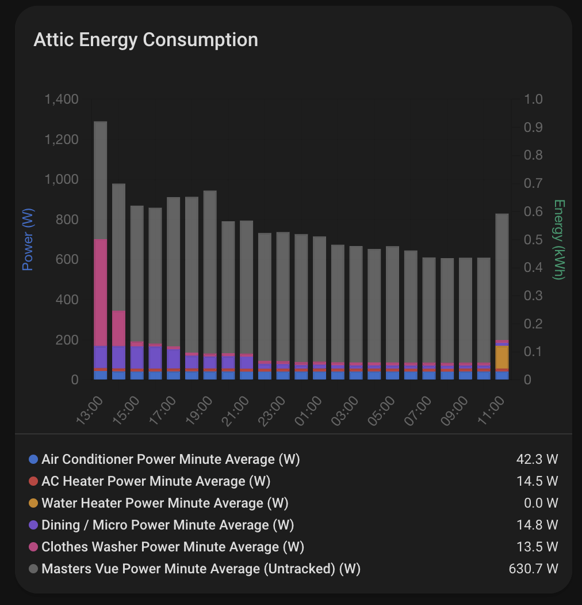

# ⚡ Ohm Assistant Card

<p align="center">
    
</p>
<p align="center"><h1 align="center">Ohm Assistant Card</h1></p>
<p align="center">
  <em>Modern energy monitoring and power consumption visualization for Home Assistant</em>
</p>


[](https://github.com/hacs/integration)


<p align="center">Built with the tools and technologies:</p>
<p align="center">
  
  
  
  
  
</p>
<br>

## Overview

A modern, professional Home Assistant custom card for displaying electricity usage and power consumption data. The Ohm Assistant Card provides real-time energy monitoring with beautiful charts and intuitive area-based entity discovery, making it easy to track your home's energy consumption patterns.

## Features

### 📊 Dual Metric Display

- **Real-time Power Monitoring** - Shows current power consumption in Watts with live updates
- **Daily Energy Tracking** - Displays daily energy usage in kWh with historical data
- **Dual Y-Axis Charts** - Separate scales for power (W) and energy (kWh) on the same chart
- **Interactive Tooltips** - Hover over data points to see exact values and timestamps


### 🎨 Modern Design

- **Professional UI** - Clean, modern card design with gradient icons and smooth animations
- **Theme Integration** - Automatically adapts to Home Assistant's light and dark themes
- **Responsive Layout** - Optimized for both desktop and mobile viewing
- **Visual Indicators** - Color-coded statistics to understand energy consumption at a glance



### 🏠 Area-Based Discovery

- **Automatic Entity Detection** - Automatically finds power and energy entities within a specified area
- **Smart Entity Mapping** - Intelligently identifies power (W) and energy (kWh) sensors
- **Device Integration** - Works seamlessly with Home Assistant's area and device structure
- **Flexible Configuration** - Override auto-discovery with custom entity lists

### 📈 Advanced Charting

- **Interactive Charts** - Built with Chart.js for smooth, responsive data visualization
- **Chart Type Selection** - Choose between Line charts (detailed) or Stacked Bar charts (overview)
  - Line charts: 5-minute data aggregation for smooth, detailed visualization
  - Bar charts: Hourly aggregation for larger, easier-to-read bars with stacking support
- **Untracked Power Visualization** - See power consumption not tracked by individual entities (bar charts only)
  - Automatically calculates: `untracked = total_power - sum(tracked_power_entities)`
  - Displays as a gray bar stacked on top of tracked power
  - Perfect for identifying phantom loads and unmetered devices
- **Multiple Line Types** - Choose from normal, gradient, gradient-no-fill, or no-fill line styles
- **Customizable Legends** - Configure legend display (entities, compact, or none)
- **Axis Control** - Show/hide X and Y axes independently
- **Time-based Data** - Automatic time scaling with proper date/time formatting


No Fill


Gradient No Fill


Gradient


Bar Chart w/ Untracked Consumption

### ⚙️ Flexible Configuration

- **Visual Editor** - Easy configuration through Home Assistant's card editor
- **YAML Support** - Full YAML configuration for advanced users
- **Feature Flags** - Toggle functionality like hiding card name or excluding default entities
- **Chart Customization** - Fine-tune chart appearance and behavior
- **Entity Override** - Specify custom entities to include or exclude

## Installation

### Prerequisites

> [!NOTE]  
> This card works with any Home Assistant entities that have `device_class: power` (for Watts) or `device_class: energy` (for kWh). No additional integrations are required.

### HACS (Recommended)

NOTE: may not work until the project is added to HACS official, see Manual Installation

[](https://my.home-assistant.io/redirect/hacs_repository/?owner=homeassistant-extras&repository=ohm-assistant&category=dashboard)

1. Open HACS in your Home Assistant instance
2. Click the menu icon in the top right and select "Custom repositories"
3. Add this repository URL and select "Dashboard" as the category
   - `https://github.com/homeassistant-extras/ohm-assistant`
4. Click "Install"

### Manual Installation

1. Download the `ohm-assistant.js` file from the latest release in the Releases tab.
2. Copy it to your `www/community/ohm-assistant/` folder
3. Add the following to your `configuration.yaml` (or add as a resource in dashboards menu)

```yaml
lovelace:
  resources:
    - url: /local/community/ohm-assistant/ohm-assistant.js
      type: module
```

## Usage

Add the card to your dashboard using the UI editor or YAML:

### Card Editor

The card is fully configurable through the card editor, allowing you to customize:

- Area selection for automatic entity discovery
- Custom entity lists
- Chart configuration options
- Feature toggles

### YAML

This is the most minimal configuration needed to get started:

```yaml
type: custom:area-energy-card
area: living_room
```

For custom entity configuration:

```yaml
type: custom:area-energy-card
area: living_room
entities:
  - sensor.living_room_power
  - sensor.living_room_energy
```

The card will automatically:

- Detect power and energy entities within the specified area
- Create beautiful charts with dual Y-axis (power in W, energy in kWh)
- Display real-time data with historical context
- Adapt to your Home Assistant theme

## Configuration Options

| Name     | Type   | Default      | Description                                                   |
| -------- | ------ | ------------ | ------------------------------------------------------------- |
| area     | string | **Required** | The area name to automatically discover energy/power entities |
| name     | string | Area Energy  | Custom name for the card                                      |
| entities | array  | _auto_       | Custom list of entities to include (see Entity Configuration) |
| chart    | object | _none_       | Chart configuration options                                   |
| features | array  | _none_       | Feature flags to enable/disable functionality                 |

### Entity Configuration

The `entities` field accepts two formats:

**String Format** (simple entity IDs):

```yaml
entities:
  - sensor.living_room_power
  - sensor.living_room_energy
```

**Object Format** (with custom colors):

```yaml
entities:
  - entity_id: sensor.living_room_power
    color: '#ff0000' # Hex color
  - entity_id: sensor.living_room_energy
    color: 'rgba(0, 255, 0, 0.8)' # RGBA color with transparency
  - entity_id: sensor.kitchen_power
    color: 'blue' # Named color
  - entity_id: sensor.bedroom_power
    color: 'primary' # Home Assistant theme color
  - entity_id: sensor.bedroom_energy
    color: 'accent' # Home Assistant theme color
```

**Mixed Format** (combine both):

```yaml
entities:
  - sensor.living_room_power # Uses default color
  - entity_id: sensor.living_room_energy
    color: '#00ff00' # Custom color
```

When using the object format:

- `entity_id` (required): The entity ID string
- `color` (optional): Color value in any CSS format (hex, rgba, named colors, etc.) or Home Assistant theme colors (primary, accent, red, blue, green, etc.)

Entities without custom colors will use the default color scheme based on their type (power/energy) and position.

### Chart Configuration

| Name               | Type   | Default  | Description                                                          |
| ------------------ | ------ | -------- | -------------------------------------------------------------------- |
| chart_type         | string | line     | Chart type: line (detailed) or stacked_bar (overview)                |
| total_power_entity | string | _none_   | Total power entity ID for untracked power visualization (bar charts) |
| legend_style       | string | entities | Legend display style: entities, compact, none                        |
| axis_style         | string | all      | Axis display: all, x_only, y_only, none                              |
| line_type          | string | normal   | Line style: normal, gradient, gradient_no_fill, no_fill              |

### Feature Flags

| Feature                  | Description                              |
| ------------------------ | ---------------------------------------- |
| hide_name                | Hide the card name from display          |
| exclude_default_entities | Exclude default auto-discovered entities |

### Entity Requirements

**Power Entity:**

- `device_class: power`
- `unit_of_measurement: W`
- Example: `sensor.living_room_power`

**Energy Entity:**

- `device_class: energy`
- `unit_of_measurement: kWh`
- Example: `sensor.living_room_energy`

### Auto-discovery

The card automatically discovers energy and power entities within the specified area based on:

- Entity `device_class` (power or energy)
- Entity `unit_of_measurement` (W for power, kWh for energy)
- Entity relationships to the area

This includes sensors with the appropriate device classes and units.

## Example Configurations

### Basic Configuration

```yaml
type: custom:area-energy-card
area: living_room
```

### With Custom Name

```yaml
type: custom:area-energy-card
area: living_room
name: 'Living Room Energy Monitor'
```

### With Custom Entities

```yaml
type: custom:area-energy-card
area: living_room
entities:
  - sensor.living_room_power
  - sensor.living_room_energy
```

### With Custom Entity Colors

```yaml
type: custom:area-energy-card
area: living_room
entities:
  - sensor.living_room_power # Default color
  - entity_id: sensor.living_room_energy
    color: '#ff6b6b' # Custom red color
  - entity_id: sensor.kitchen_power
    color: '#4ecdc4' # Custom teal color
  - entity_id: sensor.bedroom_power
    color: 'primary' # Home Assistant theme color
```

### With Chart Configuration

```yaml
type: custom:area-energy-card
area: living_room
chart:
  chart_type: stacked_bar # Use bar charts for better overview
  legend_style: compact
  axis_style: y_only
  line_type: gradient
```

### With Untracked Power Visualization

```yaml
type: custom:area-energy-card
area: living_room
chart:
  chart_type: stacked_bar # Required for untracked power
  total_power_entity: sensor.total_power # Your total power entity
```

**Note**: Untracked power visualization only works with `chart_type: stacked_bar`. The card will automatically calculate and display the difference between total power and the sum of tracked power entities.

### With Feature Flags

```yaml
type: custom:area-energy-card
area: living_room
features:
  - hide_name
  - exclude_default_entities
```

### Full Configuration Example

```yaml
type: custom:area-energy-card
area: living_room
name: 'Living Room Energy Monitor'
entities:
  - sensor.living_room_power # Default color
  - entity_id: sensor.living_room_energy
    color: '#10b981' # Custom green color
chart:
  chart_type: stacked_bar # Use bar charts
  total_power_entity: sensor.total_power # Track untracked power
  legend_style: entities
  axis_style: all
  line_type: gradient_no_fill
features:
  - hide_name
```

## Screenshots

_Coming soon - screenshots of the card in action will be added here._

## Project Roadmap

- [x] **`Initial design`**: Create initial area energy card design
- [x] **`Area-based discovery`**: Automatic detection of energy/power entities within areas
- [x] **`Dual metric display`**: Real-time power (W) and energy (kWh) visualization
- [x] **`Chart integration`**: Chart.js implementation with dual Y-axis support
- [x] **`Modern UI`**: Professional design with theme integration
- [x] **`Configuration options`**: Visual editor and YAML support
- [x] **`Feature flags`**: Toggle functionality like hiding card name
- [x] **`Chart customization`**: Multiple line types and legend styles
- [x] **`Performance optimization`**: Efficient rendering with memoization
- [x] **`TypeScript support`**: Full type safety and modern development
- [x] **`UI improvements`**: Tweaks and changes for the UI - thanks @LamarcLS
- [x] **`Custom entity colors`**: Choose colors for individual chart items - thanks @LamarcLS
- [x] **`Chart type selection`**: Line and Stacked Bar chart options - thanks @LamarcLS
- [x] **`Untracked power visualization`**: Visualize power consumption not tracked by individual entities - thanks @LamarcLS

## Contributing

- **💬 [Join the Discussions](https://github.com/homeassistant-extras/ohm-assistant/discussions)**: Share your insights, provide feedback, or ask questions.
- **🐛 [Report Issues](https://github.com/homeassistant-extras/ohm-assistant/issues)**: Submit bugs found or log feature requests for the `ohm-assistant` project.
- **💡 [Submit Pull Requests](https://github.com/homeassistant-extras/ohm-assistant/blob/main/CONTRIBUTING.md)**: Review open PRs, and submit your own PRs.
- **📣 [Check out discord](https://discord.gg/NpH4Pt8Jmr)**: Need further help, have ideas, want to chat?
- **🃏 [Check out my other cards!](https://github.com/orgs/homeassistant-extras/repositories)** Maybe you have an integration that I made cards for.

<details closed>
<summary>Contributing Guidelines</summary>

1. **Fork the Repository**: Start by forking the project repository to your GitHub account.
2. **Clone Locally**: Clone the forked repository to your local machine using a git client.
   ```sh
   git clone https://github.com/homeassistant-extras/ohm-assistant
   ```
3. **Create a New Branch**: Always work on a new branch, giving it a descriptive name.
   ```sh
   git checkout -b new-feature-x
   ```
4. **Make Your Changes**: Develop and test your changes locally.
5. **Commit Your Changes**: Commit with a clear message describing your updates.
   ```sh
   git commit -m 'Implemented new feature x.'
   ```
6. **Push to GitHub**: Push the changes to your forked repository.
   ```sh
   git push origin new-feature-x
   ```
7. **Submit a Pull Request**: Create a PR against the original project repository. Clearly describe the changes and their motivations.
8. **Review**: Once your PR is reviewed and approved, it will be merged into the main branch. Congratulations on your contribution!
</details>

## Development

### Prerequisites

- Node.js 18+
- Yarn or npm

### Setup

```bash
cd ohm-assistant
yarn install
```

### Development Mode

```bash
yarn watch
```

### Build

```bash
yarn build
```

### Testing

```bash
yarn test
```

### Formatting

```bash
yarn format
```

## License

This project is protected under the MIT License. For more details, refer to the [LICENSE](LICENSE) file.

## Acknowledgments

- Built using [LitElement](https://lit.dev/)
- Chart visualization powered by [Chart.js](https://www.chartjs.org/)
- Inspired by modern energy monitoring dashboards
- Thanks to all contributors!

[](https://github.com/homeassistant-extras/ohm-assistant/graphs/contributors)

[](https://ko-fi.com/N4N71AQZQG)

## Code Quality

Forgive me and my badges..

Stats

[](https://sonarcloud.io/summary/new_code?id=homeassistant-extras_ohm-assistant)
[](https://sonarcloud.io/summary/new_code?id=homeassistant-extras_ohm-assistant)
[](https://sonarcloud.io/summary/new_code?id=homeassistant-extras_ohm-assistant)
[](https://sonarcloud.io/summary/new_code?id=homeassistant-extras_ohm-assistant)
[](https://sonarcloud.io/summary/new_code?id=homeassistant-extras_ohm-assistant)
[](https://sonarcloud.io/summary/new_code?id=homeassistant-extras_ohm-assistant)
[](https://sonarcloud.io/summary/new_code?id=homeassistant-extras_ohm-assistant)

Ratings

[](https://sonarcloud.io/summary/new_code?id=homeassistant-extras_ohm-assistant)
[](https://sonarcloud.io/summary/new_code?id=homeassistant-extras_ohm-assistant)
[](https://sonarcloud.io/summary/new_code?id=homeassistant-extras_ohm-assistant)
[](https://sonarcloud.io/summary/new_code?id=homeassistant-extras_ohm-assistant)

## Build Status

### Main

[](https://github.com/homeassistant-extras/ohm-assistant/actions/workflows/github-code-scanning/codeql)
[](https://github.com/homeassistant-extras/ohm-assistant/actions/workflows/dependabot/dependabot-updates)
[](https://github.com/homeassistant-extras/ohm-assistant/actions/workflows/main-ci.yaml)
[](https://github.com/homeassistant-extras/ohm-assistant/actions/workflows/pull_request.yaml)

### Release

[](https://github.com/homeassistant-extras/ohm-assistant/actions/workflows/release-cd.yaml)
[](https://github.com/homeassistant-extras/ohm-assistant/actions/workflows/merge.yaml)

### Other

[](https://github.com/homeassistant-extras/ohm-assistant/actions/workflows/assign.yaml)
[](https://github.com/homeassistant-extras/ohm-assistant/actions/workflows/manual-release.yaml)
